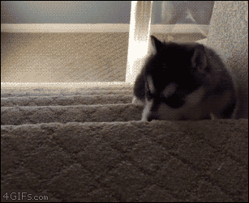

# FINTICS (Financial System Trading Application)

[](https://github.com/sponsors/chomookun)
[](https://ko-fi.com/chomookun)

If you don't have your own investment strategy and philosophy, Don't do it.<br/> 
If you mess up, you'll be in big trouble.<br/>
This program only automates your own investment strategy.




---

## 🖥️ Demo site

Credentials: **developer/developer**

### Management web application (google cloud run)
[](https://gcp.fintics-web.chomookun.org)
<br/>
Due to a cold start, there is an initialization delay of approximately 30 seconds.<br/>
(No money!!!)

### Trading daemon application

<br/>
Trading daemon is not available on the demo site.<br/>
(No money!!!)

---

## 🧪 Running from source code

### Configures Gradle 
Adds private maven repository
```shell
vim ~/.gradle/init.gradle
...
allprojects {
    repositories {
        // ...
        maven {
            url = "https://nexus.chomookun.org/repository/maven-public/"
        }
        // ...
    }
}
...
```

### Starts fintics-daemon
Runs the trading daemon application.
```shell
# starts fintics-daemon
./gradlew :fintics-daemon:bootRun
```

### Starts fintics-web
Runs the UI management web application.
```shell
# starts fintics-web
./gradlew :fintics-web:bootRun
```

---

## 🧪 Running from release binary

Downloads Released archives.

### Starts fintics-daemon

```shell
./bin/fintics-daemon
```

### Starts fintics-web
```shell
./bin/fintics-web
```

---

## 🧪 Running from container image

### Starts fintics-daemon
```shell
docker run -rm -p 8081:8081 docker.io/chomoookun/fintics-daemon:latest
```

### Starts fintics-web
```shell
docker run -rm -p 8080:8080 docker.io/chomoookun/fintics-web:latest
```

---

## 🔗 References

### Git source repository
[](https://github.com/chomookun/fintics)

### Arch4j framework (based on spring boot)
[](https://github.com/chomookun/arch4j)

---

## 💼 My Passive EMP(ETF Managed Portfolio)

### Concept
- Seeking a Balance Between Growth and Dividend
- Hedging Through a Balanced Allocation of Growth, Dividends, and Bonds
- Targeting Stable Cash Flow via Monthly Income Distributions

### Rebalance Strategy
- Buying at oversold level.
- Selling at overbought level.

ps. Technical Indicator: RSI, CCI, Stochastic Slow, Williams %R 

### 1. US Market (50% of Passive EMP)

- Equity.Growth: 25%
- Equity.Value: 25%
- Bond.Sovereign: 12.5%
- Bond.Credit: 12.5%
- Cash Equivalent: 25%

#### [25%] Equity.Growth ETF

| Symbol   | Name                                             | Holding weight | Reference                                                 |
|----------|--------------------------------------------------|----------------|-----------------------------------------------------------|
| **SPUS** | SP Funds S&P 500 Sharia Industry Exclusions ETF  | 8.33%          | [Nasdaq](https://www.nasdaq.com/market-activity/etf/spus) |
| **QDVO** | Amplify CWP Growth & Income ETF                  | 8.33%          | [Nasdaq](https://www.nasdaq.com/market-activity/etf/gdvo) |
| **GPIQ** | Goldman Sachs Nasdaq-100 Core Premium Income ETF | 8.33%          | [Nasdaq](https://www.nasdaq.com/market-activity/etf/gpiq) |

#### [25%] Equity.Value ETF

| Symbol   | Name                                         | Holding weight | Reference                                                  |
|----------|----------------------------------------------|----------------|------------------------------------------------------------|
| **DGRW** | WisdomTree U.S. Quality Dividend Growth Fund | 8.33%          | [Nasdaq](https://www.nasdaq.com/market-activity/etf/dgrw)  |
| **DIVO** | Amplify CPW Enhanced Dividend Income ETF     | 8.33%          | [Nasdaq](https://www.nasdaq.com/market-activity/etf/divo)  |
| **DLN**  | WisdomTree U.S. LargeCap Dividend Fund       | 8.33%          | [Nasdaq](https://www.nasdaq.com/market-activity/etf/dln/)  |

#### [12.5%] Bond.Sovereign ETF

| Symbol   | Name | Holding weight | Reference                                                                  |
|----------|--|----------------|----------------------------------------------------------------------------|
| **GOVI** | Invesco Equal Weight 0-30 Year Treasury ETF | 6.25%          | [Nasdaq](https://www.nasdaq.com/market-activity/etf/govi) |
| **GOVT** | iShares U.S. Treasury Bond ETF | 6.25%          | [Nasdaq](https://www.nasdaq.com/market-activity/etf/govi) |

#### [12.5%] Bond.Credit ETF
| Symbol   | Name                           | Holding weight | Reference                                                                  |
|----------|--------------------------------|----------------|----------------------------------------------------------------------------|
| **TIP**  | iShares TIPS Bond ETF | 3.12%          | [Nasdaq](https://www.nasdaq.com/market-activity/etf/tip)  |
| **FBND** | Fidelity Total Bond ETF | 3.12%          | [Nasdaq](https://www.nasdaq.com/market-activity/etf/fbnd) |
| **IGLD** | FT Vest Gold Strategy Target Income ETF | 3.12%          | [Nasdaq](https://www.nasdaq.com/market-activity/etf/igld) |
| **PYLD** | PIMCO Multisector Bond Active ETF | 3.12%          | [Nasdaq](https://www.nasdaq.com/market-activity/etf/pyld) |

#### [25%] Cash Equivalent ETF
| Symbol   | Name                   | Holding weight | Reference                                                                  |
|----------|------------------------|----------------|----------------------------------------------------------------------------|
| **SGOV** | iShares 0-3 Month Treasury Bond ETF | 12.5%          | [Nasdaq](https://www.nasdaq.com/market-activity/etf/sgov) |
| **USFR** | WisdomTree Floating Rate Treasury Fund | 12.5%          | [Nasdaq](https://www.nasdaq.com/market-activity/etf/usfr) |


### 2. KR Market (50% of Passive EMP)

- US.Equity.Growth: 12.5% 
- US.Equity.Value: 12.5% 
- KR.Equity.Growth: 12.5% 
- KR.Equity.Value: 12.5% 
- US.Bond.Sovereign: 12.5% 
- US.Bond.Credit: 12.5%
- Cash Equivalent: 25%

#### [12.5%] US.Equity.Growth ETF

| Symbol     | Name                    | Holding weight | Reference |
|------------|-------------------------|----------------|-------------------------------------|
| **486290** | TIGER 미국나스닥100타겟데일리커버드콜 | 4.16%          | [K-ETF](https://www.k-etf.com/etf/486290) |
| **0144L0** | KODEX 미국성장커버드콜액티브       | 4.16%          | [K-ETF](https://www.k-etf.com/etf/0144L0) |
| **482730** | TIGER 미국S&P500타겟데일리커버드콜 | 4.16%          | [K-ETF](https://www.k-etf.com/etf/482730) |

#### [12.5%] US.Equity.Value ETF

| Symbol | Name     | Holding weight | Reference                           |
|------|----------|----------------|-------------------------------------|
| **441640** | KODEX 미국배당커버드콜액티브 | 4.16%          | [K-ETF](https://www.k-etf.com/etf/441640) |
| **0046Y0** | ACE 미국배당퀄리티 | 4.16%          | [K-ETF](https://www.k-etf.com/etf/0046Y0) |
| **458730** | TIGER 미국배당다우존스         | 4.16%          | [K-ETF](https://www.k-etf.com/etf/458730) |

#### [12.5%] KR.Equity.Growth ETF

| Symbol | Name               | Holding weight | Reference |
|------|--------------------|----------------|-------------------------------------|
| **498400** | KODEX 200타겟위클리커버드콜 | 4.16%          | [K-ETF](https://www.k-etf.com/etf/498400) |
| **472150** | TIGER 배당커버드콜액티브    | 4.16%          | [K-ETF](https://www.k-etf.com/etf/472150) |
| **496080** | TIGER 코리아밸류업       | 4.16%          | [K-ETF](https://www.k-etf.com/etf/496080) |

#### [12.5%] KR.Equity.Value ETF

| Symbol | Name   | Holding weight | Reference |
|------|--------|----------------|-------------------------------------|
| **441800** | TIMEFOLIO Korea플러스배당액티브 | 4.16%          | [K-ETF](https://www.k-etf.com/etf/441800) |
| **161510** | PLUS 고배당주 | 4.16%          | [K-ETF](https://www.k-etf.com/etf/161510) |
| **0052D0** | TIGER 코리아배당다우존스 | 4.16%          | [K-ETF](https://www.k-etf.com/etf/0052D0) |

#### [12.5%] US.Bond.Sovereign ETF

| Symbol    | Name | Holding weight | Reference                                 |
|-----------|--|----------------|-------------------------------------------|
| **476760** | ACE 미국30년국채액티브 | 4.16%          | [K-ETF](https://www.k-etf.com/etf/476760) |
| **0085P0** | ACE 미국10년국채액티브 | 4.16%          | [K-ETF](https://www.k-etf.com/etf/0085P0) |
| **0046A0** | TIGER 미국초단기(3개월이하)국채 | 4.16%          | [K-ETF](https://www.k-etf.com/etf/0046A0)       |

#### [12.5%] US.Bond.Credit ETF

| Symbol | Name | Holding weight | Reference                                                            |
|------|----|----------------|----------------------------------------------------------------------|
| **468370** | KODEX iShares미국인플레이션국채액티브 | 3.12%          | [K-ETF](https://www.k-etf.com/etf/468370) |
| **468630** | KODEX iShares미국투자등급회사채액티브 | 3.12%          | [K-ETF](https://www.k-etf.com/etf/468630) |
| **468380** | KODEX iShares미국하이일드액티브 | 3.12%          | [K-ETF](https://www.k-etf.com/etf/468380) |
| **0022T0** | SOL 국제금커버드콜액티브 | 3.12%          | [K-ETF](https://www.k-etf.com/etf/0022T0) |

#### [25%] Cash Equivalent ETF
| Symbol | Name | Holding weight | Reference                                                |
|------|--|----------------|----------------------------------------------------------|
| **488770** | KODEX 머니마켓액티브 | 8.33%          | [K-ETF](https://www.k-etf.com/etf/488770) |
| **497880** | SOL CD금리&머니마켓액티브 | 8.33%          | [K-ETF](https://www.k-etf.com/etf/497880) |
| **423160** | KODEX KOFR금리액티브(합성) | 8.33%          | [K-ETF](https://www.k-etf.com/etf/423160) |


